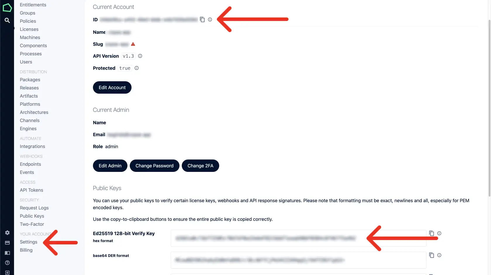
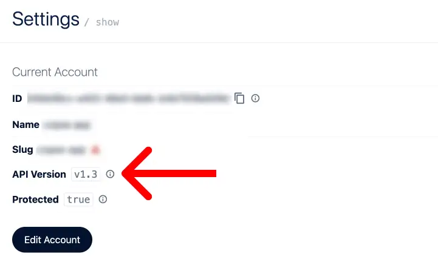
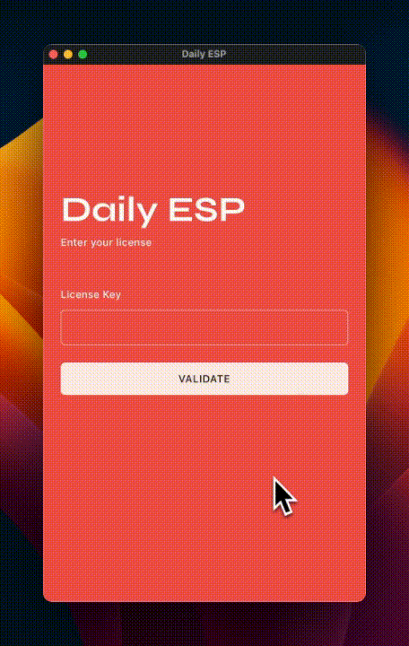
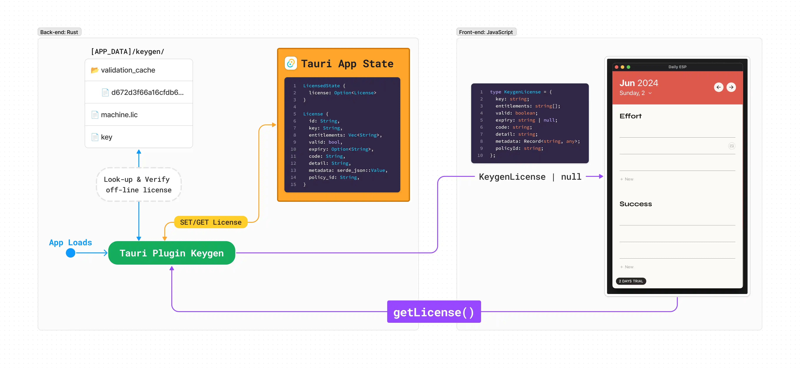
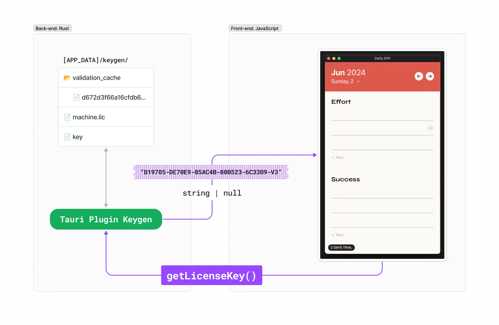
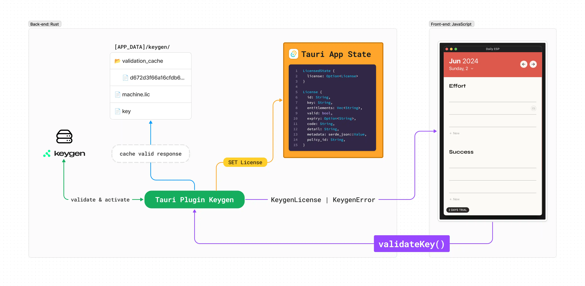
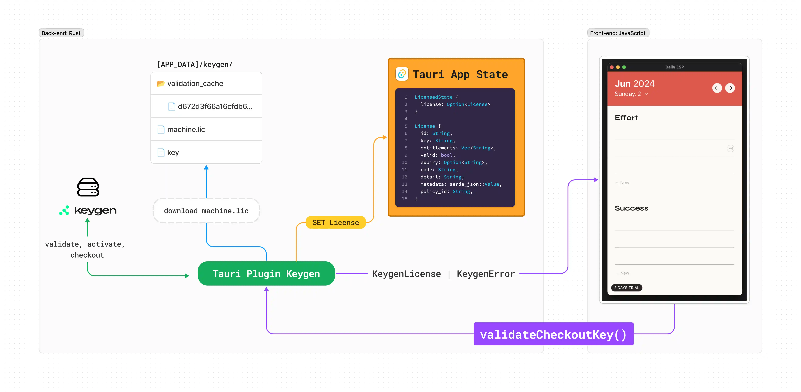

# Tauri Plugin keygen

This plugin helps you implement timed licensing (with trial) and feature-base licensing for your Tauri desktop app using the [Keygen Licensing API](https://keygen.sh/docs/api/?via=tauri-plugin).

It handles license validation requests, verifies response signatures, caches valid responses, and manages the machine file for offline licensing.

Licensed state is managed in the Tauri App State (Rust back-end), and can be accessed via JavaSript Guest bindings in the front-end.

<br /><br />

## Sponsored by

<a href="https://keygen.sh/?via=tauri-plugin"></a>

<br /><br />

## 📖 Table of Contents

- [Table of Contents](#-table-of-contents)
- [Video Tutorial](#-video-tutorial)
- [Install](#%EF%B8%8F-install)
- [Setup](#-setup)
  - [Custom Configs](#%EF%B8%8F-custom-configs)
  - [with_custom_domain](#-with_custom_domain)
- [Usage](#-usage)
  - [Timed License - with trial](#%EF%B8%8F-timed-license---with-trial)
  - [Feature Base License](#%EF%B8%8F-feature-base-license)
- [JavaScript Guest Bindings](#-javascript-guest-bindings)
  - [getLicense](#-getlicense)
  - [getLicenseKey](#%EF%B8%8F-getlicensekey)
  - [validateKey](#-validatekey)
  - [validateCheckoutKey](#--validatecheckoutkey)
  - [resetLicense](#-resetlicense)
  - [resetLicenseKey](#-resetlicensekey)

<br /><br />

## 📺 Video Tutorial


<br /><br />

## ⬇️ Install

🦀 Add the following line to `src-tauri/cargo.toml` to install the core plugin:

```toml
[dependencies]
tauri-plugin-keygen = { git = "https://github.com/bagindo/tauri-plugin-keygen", branch = "v2" }
```

<br />

👾 Install the JavaScript Guest bindings:

```sh
npm add https://github.com/bagindo/tauri-plugin-keygen#v2
```

<br /><br />

## 🔌 Setup

First, [sign-up for a free account](https://keygen.sh/?=tauri-plugin) and get your Keygen Account ID and Keygen Verify Key.



<br />

Then, add them to the plugin builder in `src-tauri/src/main.rs`

```rust
fn main() {
    tauri::Builder::default()
        // register plugin
        .plugin(
            tauri_plugin_keygen::Builder::new(
                "17905469-e476-49c1-eeee-3d60e99dc590", // 👈 Keygen Account ID
                "1e1e411ee29eee8e85ee460ee268921ee6283ee625eee20f5e6e6113e4ee2739", // 👈 Keygen (Public) Verify Key
            )
            .build(),
        )
        .run(tauri::generate_context!())
        .expect("error while running tauri application");
}

```

<br />

### ⚙️ Custom Configs

Optionally, you can specify custom configs to the plugin builder.

```rust
fn main() {
    tauri::Builder::default()
        // register plugin
        .plugin(
            tauri_plugin_keygen::Builder::new(
                "17905469-e476-49c1-eeee-3d60e99dc590", // 👈 Keygen Account ID
                "1e1e411ee29eee8e85ee460ee268921ee6283ee625eee20f5e6e6113e4ee2739", // 👈 Keygen (Public) Verify Key
            )
            // chain custom config as needed
            .api_url("https:://licensing.myapp.com") // 👈 Self-hosted Keygen API url
            .version_header("1.7") // 👈 add Keygen-Version on request header
            .cache_lifetime(1440) // 👈 Response cache lifetime in minutes
            .build(),
        )
        .run(tauri::generate_context!())
        .expect("error while running tauri application");
}

```

<table>
    <thead>
    <tr>
        <th>Config</th>
        <th>Default</th>
        <th>Description</th>
    </tr>
    </thead>
    <tbody>
    <tr>
        <td>api_url</td>
        <td><code>https://api.keygen.sh</code></td>
        <td>
        <p></p>
        <p>Keygen API base URL.</p>
        <p>This config is useful if you're using Keygen <a href="https://keygen.sh/docs/self-hosting/?=tauri-plugin" target="_blank">Self Hosting</a>.</p>
        <p>
            Trailing <code>/</code> matters for dir paths:
        </p>
        <ul>
            <li>
            <code>https://www.my-app.com/api/</code> :white_check_mark:
            </li>
            <li>
            <code>https://www.my-app.com/api</code> :x:
            </li>
        </ul>
        <p></p>
        </td>
    </tr>
    <tr>
        <td>version_header</td>
        <td><code>None</code></td>
        <td>
        <p></p>
        <p>
        Keygen
        <a href="https://keygen.sh/docs/api/versioning/?via=tauri-plugin#pinning" target="_blank">pinned</a> the API version you're using to your account.
        <p>
        
        </p>
        </p>
        <p>This config is useful to test that everything still works, before you change your account's API version (e.g. from 1.3 to 1.7) on the Keygen Dashboard.</p>
        <p>Don't prefix the version string:</p>
        <ul>
            <li>
            <code>.version_header("v1.7")</code> :x:
            </li>
            <li>
            <code>.version_header("1.7")</code> :white_check_mark:
            </li>
        </ul>
        <p></p>
        </td>
    </tr>
    <tr id="cache-lifetime-config">
        <td>cache_lifetime</td>
        <td><code>240</code></td>
        <td>
        <p></p>
        <p>The allowed lifetime, in minutes, for the cached <a href="https://keygen.sh/docs/api/licenses/?via=tauri-plugin#licenses-actions-validate-key" target="_blank">validation response</a>.</p>
        <p>Min 60 mins. Max 1440 mins (24h).</p>
        <p>ℹ️ The cache is keyed with a hash of the today's date (<code>"YYYY-MM-DD"</code>) and the license key.</p>
        <p>So, the maximum lifetime won't actually be the full 1440 mins, as the today's cache won't be loaded on midnight (the next day).</p>
        <p>For a longer offline licensing capability, you should use <code><a href="#rocket-computer-validatecheckoutkey">validateCheckoutKey()</a></code>, instead of relying on the validation response cache.
        <p></p>
        </td>
    </tr>
    </tbody>
</table>

<br />

### 🌐 `with_custom_domain`

You don't need to specify your Keygen Account ID if you're using Keygen [Custom Domain](https://keygen.sh/docs/custom-domains/?via=tauri-plugin).

```rust
fn main() {
    tauri::Builder::default()
        // register plugin
        .plugin(
            tauri_plugin_keygen::Builder::with_custom_domain(
                "https://licensing.myapp.com", // 👈 Your Keygen Custom Domain
                "1e1e411ee29eee8e85ee460ee268921ee6283ee625eee20f5e6e6113e4ee2739", // 👈 Keygen (Public) Verify Key
            )
            // chain custom config as needed
            .version_header("1.7") // 👈 add Keygen-Version on request header
            .cache_lifetime(1440) // 👈 Response cache lifetime in minutes
            .build(),
        )
        .run(tauri::generate_context!())
        .expect("error while running tauri application");
}

```

> [!NOTE]
> Chaining the `api_url` config won't matter here.

<br /><br />

## ⚡ Usage

### ⏱️ Timed License - with trial



In this [example](https://github.com/bagindo/tauri-plugin-keygen/tree/main/examples/esp-trial-license), the app's main page is guarded by a layout route `_licensed.tsx`, that will re-direct users to the validation page if they don't have a valid license.

Watch the [video tutorial](#-video-tutorial) for the step-by-step implementation.

The main code snippets:

<details>
<summary>🗒️ Routes Guard</summary>

#### `_licensed.tsx`

```javascript
// Tauri
import { getLicense, getLicenseKey } from "tauri-plugin-keygen-api";
// React
import { createFileRoute, redirect, Outlet } from "@tanstack/react-router";

export const Route = createFileRoute("/_licensed")({
  // Before this layout route loads
  beforeLoad: async ({ location }) => {
    const license = await getLicense();
    const licenseKey = await getLicenseKey();

    // no valid licenses
    if (license === null) {
      // re-direct to license validation page
      throw redirect({
        to: "/validate", // the equivalent of a Login page in an Auth based system
        search: {
          redirect: location.href,
          cachedKey: licenseKey || "",
        },
      });
    }
  },
  component: () => <Outlet />,
});
```

</details>

<details>
<summary>🗒️ Validation Page</summary>

#### `validate.tsx`

```javascript
// Tauri
import {
  type KeygenError,
  type KeygenLicense,
  validateKey,
} from "tauri-plugin-keygen-api";
// React
import { useState } from "react";
import { createFileRoute, useRouter } from "@tanstack/react-router";
import { z } from "zod";

// Route Definition
export const Route = createFileRoute("/validate")({
  validateSearch: z.object({
    redirect: z.string().optional().catch(""),
    cachedKey: z.string(),
  }),
  component: () => <Validate />,
});

// License Validation Page
function Validate() {
  // routes
  const router = useRouter();
  const navigate = Route.useNavigate();
  const { redirect, cachedKey } = Route.useSearch();

  // local states
  const [key, setKey] = useState(cachedKey);
  const [loading, setLoading] = useState(false);
  const [err, setErr] = useState("");

  const validate = async () => {
    setErr("");
    setLoading(true);

    let license: KeygenLicense;

    // validate license key
    try {
      license = await validateKey({ key });
    } catch (e) {
      const { code, detail } = e as KeygenError;
      setErr(`${code}: ${detail}`);
      setLoading(false);
      return;
    }

    // check license
    if (license.valid) {
      await router.invalidate();
      await navigate({ to: redirect || "/" });
    } else {
      setErr(`${license.code}: ${license.detail}`);
    }

    setLoading(false);
  };

  return (
    <div>
      ...
      {/* License Key Input */}
      <div>
        <label htmlFor="license-key">License Key</label>
        <input
          autoFocus
          id="license-key"
          value={key}
          onChange={(e) => setKey(e.target.value)}
        />
      </div>
      {/* Validate Button */}
      <button onClick={validate}>Validate</button>
      {/* Help Text */}
      {loading && <div>validating license...</div>}
      {err !== "" && <div>{err}</div>}
    </div>
  );
}
```

</details>

<br />

### 🎖️ Feature Base License


In this [example](https://github.com/bagindo/tauri-plugin-keygen/tree/main/examples/esp-feature-license), users can access the app without having a license, except when they want to add an image to an ESP item.

Watch the [video tutorial](#-video-tutorial) for the step-by-step implementation.

The main code snippets:

<details>
<summary>🗒️ Main Page</summary>

#### `esp.tsx`

```javascript
// Tauri
import { getLicense } from "tauri-plugin-keygen-api";
// React
...
import { useAtom } from "jotai";
// App
import { proLicenseModalAtom } from "../atoms";
import ProLicenseModal from "../components/ProLicenseModal";

// Main Page
function ESP() {
    return (
        <div>
            ...
            <div>
                ...
                <ChooseImageButton />
            <div>
            <ProLicenseModal />
        </div>
    );
}

// PRO Feature Component
function ChooseImageButton({
  onImageChosen,
}: {
  onImageChosen: (file: string) => void;
}) {
  // there's always a delay when opening the native file dialog with Tauri
  // this lets the users know that "dialogOpen" is in progress by showing a Spinner
  const [isOpeningFile, setIsOpeningFile] = useState(false);
  const [_, setProModalOpened] = useAtom(proLicenseModalAtom);

  const chooseImage = async () => {
    setIsOpeningFile(true);

    // get license
    const license = await getLicense();

    // check license and its entitlements
    if (license === null || !license.valid || !license.entitlements.includes("ADD_IMAGE")) {
      setProModalOpened(true); // Show Modal: "This feature requires a PRO License"
      setIsOpeningFile(false);
      return;
    }

    const file = await openFileDialog({
      multiple: false,
      title: "Choose Image",
      filters: [
        {
          name: "Image",
          extensions: ["png", "webp", "avif", "jpg", "jpeg"],
        },
      ],
    });

    if (!Array.isArray(file) && file !== null) {
      onImageChosen(file);
    }

    setIsOpeningFile(false);
  };

  return (
    <button onClick={chooseImage}>
      {isOpeningFile ? <Spinner /> : <PhotoIcon className="size-3.5" />}
    </button>
  );
}
```

</details>

<details>
<summary>🗒 Pro License Modal</summary>

#### `ProLicenseModal.tsx`

```javascript
// Tauri
import { open as openLink } from "@tauri-apps/api/shell";
// React
import * as Dialog from "@radix-ui/react-dialog";
import { Link, useLocation } from "@tanstack/react-router";
import { useAtom } from "jotai";
// App
import { proLicenseModalAtom } from "../atoms";

export default function ProLicenseModal() {
  const location = useLocation();
  const [modalOpened, setModalOpened] = useAtom(proLicenseModalAtom);

  return (
    <Dialog.Root open={modalOpened} onOpenChange={setModalOpened}>
      <Dialog.Portal>
        <Dialog.Overlay />
        <Dialog.Content>
          <Dialog.Title>Pro Feature</Dialog.Title>
          <div>This is a pro feature</div>

          <div>
            {/* Go to License Validation Page */}
            <Link to="/validate" search={{ redirect: location.href }}>
              Enter License
            </Link>
            {/* Buy License */}
            <button
              onClick={() => {
                openLink("https://www.stripe.com"); // open link to your payment processor in user's default browser
              }}
            >
              Buy Pro
            </button>
          </div>

          <Dialog.Close asChild>
            <button>
              <XMarkIcon className="size-4" />
            </button>
          </Dialog.Close>
        </Dialog.Content>
      </Dialog.Portal>
    </Dialog.Root>
  );
}
```

</details>

<details>
<summary>🗒️ Validation Page</summary>

#### `validate.tsx`

```javascript
// Tauri
import {
  type KeygenError,
  type KeygenLicense,
  validateCheckoutKey,
  getLicenseKey,
} from "tauri-plugin-keygen-api";
// React
import { useState } from "react";
import { createFileRoute, useRouter } from "@tanstack/react-router";
import { z } from "zod";
// App
import { getLicenseErrMessage } from "../utils";

// Route Definition
export const Route = createFileRoute("/validate")({
  validateSearch: z.object({
    redirect: z.string().optional().catch(""),
  }),
  component: () => <Validate />,
});

// License Validation Page
function Validate() {
  // routes
  const router = useRouter();
  const navigate = Route.useNavigate();
  const { redirect } = Route.useSearch();

  // local states
  const [key, setKey] = useState("");
  const [loading, setLoading] = useState(false);
  const [err, setErr] = useState(errParam || "");

  const validate = async () => {
    setErr("");
    setLoading(true);

    let license: KeygenLicense;

    // validate and checkout machine file
    try {
      license = await validateCheckoutKey({
        key,
        entitlements: ["ADD_IMAGE"],
        ttlSeconds: 25200 /* 1 week */,
      });
    } catch (e) {
      const { code, detail } = e as KeygenError;
      setErr(getLicenseErrMessage({ code, detail }));
      setLoading(false);
      return;
    }

    if (license.valid) {
      await router.invalidate();
      await navigate({ to: redirect || "/" });
    } else {
      setErr(
        getLicenseErrMessage({
          code: license.code,
          detail: license.detail,
          policyId: license.policyId,
        })
      );
    }

    setLoading(false);
  };

  return (
    <div>
      ...
      {/* License Key Input */}
      <div>
        <label htmlFor="license-key">License Key</label>
        <input
          autoFocus
          id="license-key"
          value={key}
          onChange={(e) => setKey(e.target.value)}
        />
      </div>
      {/* Validate Button */}
      <button onClick={validate} disabled={loading}>
        Validate
      </button>
      {/* Help Text */}
      {loading && <div>validating license...</div>}
      {err !== "" && <div>{err}</div>}
    </div>
  );
}
```

</details>

<br /><br />

## 👾 JavaScript Guest Bindings

Available JavaScript APIs:

- [getLicense](#-getlicense)
- [getLicenseKey](#%EF%B8%8F-getlicensekey)
- [validateKey](#-validatekey)
- [validateCheckoutKey](#--validatecheckoutkey)
- [resetLicense](#-resetlicense)
- [resetLicenseKey](#-resetlicensekey)

<br />

### 🎫 `getLicense()`

Get the current license from the `LicensedState` in the Tauri App State.

Returns `KeygenLicense` or `null`.

```javascript
import { getLicense } from "tauri-plugin-keygen-api";

const beforeLoad = async function () => {
  let license = await getLicense();

  if (license !== null) {
    // {
    //   key: "55D303-EEA5CA-C59792-65D3BF-54836E-V3",
    //   entitlements: [],
    //   valid: true,
    //   expiry: "2024-06-22T02:04:09.028Z",
    //   code: "VALID",
    //   detail: "is valid",
    //   metadata: {},
    //   policyId: "9d930fd2-c1ef-4fdc-a55c-5cb8c571fc34",
    // }
    ...
  }
}
```



How does this plugin manages `LicensedState`?

#### 🔍 On App Loads: Look for offline license

When your Tauri app loads, this plugin will look for any offline licenses in the `[APP_DATA]/keygen/` directory.

If a machine file (`📄 machine.lic`) is found, it will [verify and decrypt](https://keygen.sh/docs/api/cryptography/?via=tauri-plugin#cryptographic-lic) the machine file, parse it into a `License` object, and load it into the Tauri App State.

If there's no machine file, it'll look for the cache in `📂 validation_cache`, [verify](https://keygen.sh/docs/api/signatures/?via=tauri-plugin#verifying-response-signatures) its signature, parse the cache into a `License` object, and load it into the Tauri App State.

#### 🚫 No valid license

If no offline license is found, or if any of the offline license found is invalid due to any of the following reasons:

- Failed to decrypt the machine file
- The machine file `ttl` has expired
- Failed to verify the response cache signature
- The cache's age has exceed the allowed [`cache_lifetime`](#cache-lifetime-config)
- The parsed license object has expired

the `LicensedState` in the Tauri App State will be set to `None` (serialized to `null` in the front-end).

#### 🔄 State Update

You can't update the `LicensedState` directly.

Aside than initiating the state from the offline licenses on app loads, this plugin will update the licensed state with the verified response from `validateKey()` or `validateCheckoutKey()`, and reset it back to `None` when you call `resetLicense()`.

<br />

### 🗝️ `getLicenseKey()`

Get the cached license key.

Returns `string` or `null`.



The license key is cached separately from the offline licenses, so that when the offline licenses expired and `getLicense()` returns `null`, you can re-validate without asking the user to re-enter their key.

```javascript
import { getLicense, getLicenseKey } from "tauri-plugin-keygen-api";

const beforeLoad = async function () => {
  let license = await getLicense();
  let licenseKey = await getLicenseKey();

  if (license === null) {
    throw redirect({
      to: "/validate", // the equivalent of a Login page in an Auth based system
      search: {
        cachedKey: licenseKey || "", // pass the cached licenseKey
      },
    });
  }
}
```

> [!TIP]
> Instead of re-directing to the `validate` page, you can re-validate the cached `licenseKey` in the background. Checkout the [video tutorial](#-video-tutorial) to see how you can do this.

<br />

### 🚀 `validateKey()`

Send [license validation](https://keygen.sh/docs/api/licenses/?via=tauri-plugin#licenses-actions-validate-key) and [machine activation](https://keygen.sh/docs/api/machines/?via=tauri-plugin#machines-create) requests.

| Params             | Type       | Required | Default | Description                                  |
| ------------------ | ---------- | -------- | ------- | -------------------------------------------- |
| key                | `string`   | ✅       | -       | The license key to be validated              |
| entitlements       | `string[]` |          | `[]`    | The list of entitlement code to be validated |
| cacheValidResponse | `boolean`  |          | `true`  | Whether or not to cache valid response       |

Returns `KeygenLicense`. Throws `KeygenError`.

```javascript
import {
  type KeygenLicense,
  type KeygenError,
  validateKey,
} from "tauri-plugin-keygen-api";

const validate = async (key: string, entitlements: string[] = []) => {
  let license: KeygenLicense;

  try {
    license = await validateKey({
      key,
      entitlements,
    });
  } catch (e) {
    const { code, detail } = e as KeygenError;
    console.log(`Err: ${code}: ${detail}`);
    return;
  }

  if (license.valid) {
    ...
  } else {
    const { code, detail } = license;
    console.log(`Invalid: ${code}: ${detail}`);
  }
};
```



What happens under the hood when you call `validateKey()`?

#### 🆔 Parsing Machine Fingerprint

This plugin parses the user's machine `fingerprint` and includes it in both [license validation](https://keygen.sh/docs/api/licenses/?via=tauri-plugin#licenses-actions-validate-key) and [machine activation](https://keygen.sh/docs/api/machines/?via=tauri-plugin#machines-create) requests.

> [!TIP]
> You can utilize machine fingerprints to prevent users from using multiple trial licenses (instead of buying one). To do this, set the `machineUniquenessStrategy` attribute to `UNIQUE_PER_POLICY` on your trial policy.
>
> See the [video tutorial](#-video-tutorial) for more details.

#### 🔏 Verifying [Response Signature](https://keygen.sh/docs/api/signatures/?via=tauri-plugin)

> A bad actor could redirect requests to a local licensing server under their control, which, by default, sends "valid" responses. This is known as a spoofing attack.

To ensure that the response received actually originates from Keygen's servers and has not been altered, this plugin checks the response's signature and verifies it using the [Verify Key](#-setup) you provided in the plugin builder.

> A bad actor could also "record" web traffic between Keygen and your desktop app, then "replay" valid responses. For example, they might replay responses that occurred before their trial license expired, in an attempt to use your software with an expired license. This is known as a replay attack.

To prevent that, this plugin will reject any response that's older than 5 minutes, even if the signature is valid.

#### 🔄 Updating State and Cache

Once the response is verified, this plugin will update the `LicensedState` in the Tauri App State with a `License` object parsed from the response.

If the `License` is valid and [`cacheValidResponse`](#-validatekey) is true, the verified response will be cached for later use as an offline license.

<br />

### 🚀 💻 `validateCheckoutKey()`

Call `validateKey()`, then [download](https://keygen.sh/docs/api/machines/?via=tauri-plugin#machines-actions-check-out) the machine file for offline licensing.

<table>
    <thead>
    <tr>
        <th>Params</th>
        <th>Type</th>
        <th>Required</th>
        <th>Default</th>
        <th>Descriptionn</th>
    </tr>
    </thead>
    <tbody>
    <tr>
        <td>key</td>
        <td><code>string</code></td>
        <td>✅</td>
        <td>-</td>
        <td>The license key to be validated</td>
    </tr>
    <tr>
        <td>entitlements</td>
        <td><code>string[]</code></td>
        <td></td>
        <td><code>[]</code></td>
        <td>The list of entitlement code to be validated</td>
    </tr>
    <tr>
        <td>ttlSeconds</td>
        <td><code>number</code></td>
        <td></td>
        <td><code>86400</code></td>
        <td>
          <p></p>
          <p>The machine file's time-to-live in seconds.</p>
          <p>Min <code>3600</code> Max <code>31_556_952</code> (1 year).</p>
          <p>The <code>ttl</code> parameter sent to the <a href="https://keygen.sh/docs/api/machines/?via=tauri-plugin#machines-actions-check-out" target="_blank">machine checkout</a> request will be the minimum of the defined <code>ttlSeconds</code> and the calculated <code>secondsToExpiry</code> of the current license.</p>
          <p></p>
        </td>
    </tr>
    <tr>
        <td>ttlForever</td>
        <td><code>boolean</code></td>
        <td></td>
        <td><code>false</code></td>
        <td>
          <p></p>
          <p>If set to true, this plugin will download a machine file that never expires.</p>
          <p>⚠️ This will only work if the current license is in <a href="https://keygen.sh/docs/api/policies/?via=tauri-plugin#policies-object-attrs-expirationStrategy" target="_blank"><code>MAINTAIN_ACCESS</code></a> state (expired but still valid).</p>
          <p>If set to true, but the current license is not in a maintain access state, this plugin will download a machine file with the defined <code>ttlSeconds</code> (default to <code>86400</code>).</p>
          <p>You might find this useful when you're implementing a <a href="https://keygen.sh/docs/choosing-a-licensing-model/perpetual-licenses/?via=tauri-plugin#perpetual-fallback-licenses" target="_blank">perpetual with fallback</a> license.</p>
          <p></p>
        </td>
    </tr>
    </tbody>
</table>

Returns `KeygenLicense`. Throws `KeygenError`.

```javascript
import {
  type KeygenLicense,
  type KeygenError,
  validateCheckoutKey,
} from "tauri-plugin-keygen-api";

const validate = async (key: string, entitlements: string[] = []) => {
  let license: KeygenLicense;

  try {
    license = await validateCheckoutKey({
      key,
      entitlements,
      ttlSeconds: 604800 /* 1 week*/,
    });
  } catch (e) {
    const { code, detail } = e as KeygenError;
    console.log(`Err: ${code}: ${detail}`);
    return;
  }

  if (license.valid) {
    ...
  } else {
    const { code, detail } = license;
    console.log(`Invalid: ${code}: ${detail}`);
  }
};
```



As with `validateKey()`, it will also parse the machine fingerprint, verify the response signature, and update the Tauri App State.

The only different is that when it received a valid license, instead of caching the response, this plugin will download the `machine.lic` file for offline licensing.

<br />

### 🔃 `resetLicense()`

Delete all the offline licenses (validation cache and machine file) in `[APP_DATA/keygen/]` and set the `LicensedState` in the Tauri App State to `None`.

<br />

### 🔃 `resetLicenseKey()`

Delete the cached license key on `[APP_DATA]/keygen/`.
